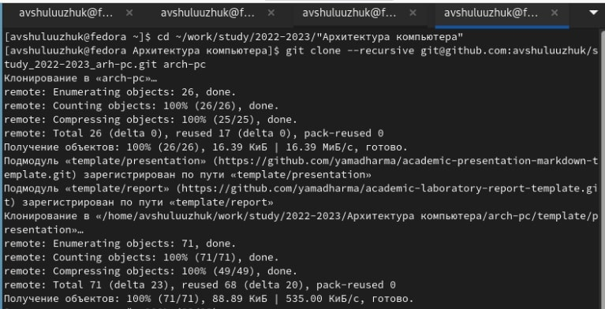

---
## Front matter
title: "Лабораторная работа № 3"
subtitle: "Система контроля версий Git"
author: "Шулуужук Айраана В."

## Generic otions
lang: ru-RU
toc-title: "Содержание"

## Bibliography
bibliography: bib/cite.bib
csl: pandoc/csl/gost-r-7-0-5-2008-numeric.csl

## Pdf output format
toc: true # Table of contents
toc-depth: 2
lof: true # List of figures
lot: true # List of tables
fontsize: 12pt
linestretch: 1.5
papersize: a4
documentclass: scrreprt
## I18n polyglossia
polyglossia-lang:
  name: russian
  options:
	- spelling=modern
	- babelshorthands=true
polyglossia-otherlangs:
  name: english
## I18n babel
babel-lang: russian
babel-otherlangs: english
## Fonts
mainfont: PT Serif
romanfont: PT Serif
sansfont: PT Sans
monofont: PT Mono
mainfontoptions: Ligatures=TeX
romanfontoptions: Ligatures=TeX
sansfontoptions: Ligatures=TeX,Scale=MatchLowercase
monofontoptions: Scale=MatchLowercase,Scale=0.9
## Biblatex
biblatex: true
biblio-style: "gost-numeric"
biblatexoptions:
  - parentracker=true
  - backend=biber
  - hyperref=auto
  - language=auto
  - autolang=other*
  - citestyle=gost-numeric
## Pandoc-crossref LaTeX customization
figureTitle: "Рис."
tableTitle: "Таблица"
listingTitle: "Листинг"
lofTitle: "Список иллюстраций"
lotTitle: "Список таблиц"
lolTitle: "Листинги"
## Misc options
indent: true
header-includes:
  - \usepackage{indentfirst}
  - \usepackage{float} # keep figures where there are in the text
  - \floatplacement{figure}{H} # keep figures where there are in the text
---

# Цель работы

Целью работы является изучить идеологию и применение средств контроля версий.
Приобрести практические навыки по работе с системой git

# Задание

1. Базовая настройка git
2. Создание SSH ключа
3. Создание рабочего пространства и репозитория курса на основе шаблона
4. Создание каталога курса
5. Выполнение самостоятельной работы

# Выполнение лабораторной работы

## Настройка github

Создаем учетную запись на сайте github и заполняем основные данные

## Базовая настройка git

Сделаем предварительную конфигурацию git (рис. [-@fig:001])

{ #fig:001 width=70% }

## Создание SSH ключа

Сгенерированный ключ ssh (рис. [-@fig:002])

{ #fig:002 width=70% }

## Создание репозитория курса на основе шаблона

1. Используя репозиторий с шаблоном курса, создаем репозиторий курса «Архитектура
компьютера» на веб-странице github
2. Клонируем созданный репозиторий (рис. [-@fig:003])

{ #fig:003 width=70% }

## Настройка каталога курса

1. Переходим в каталог курса, удаляем лишние файлы и создаем необходимые каталоги (рис. [-@fig:004])

{ #fig:004 width=70% }

2. Отправляем файлы на github. Проверяем правильность создания иерархии рабочего пространства в локальном репозитории

# Выполнение самостоятельной работы

1. создать отчет по выполнению лабораторной работы 3 в соответствующем каталоге
рабочего пространства
2. скопировать отчеты по выполнению предыдущих лабораторных работ в
соответствующие каталоги
3. загрузить файлы на github

# Выводы

Были приобретены практические навыки по работе с системой git. Изучена идеология
и применение средств контроля версий.
Итог лабораторной работы: создание рабочего пространства и нового репозитория
курса на основе шаблона, загрузка файлов на github

::: {#refs}
:::
