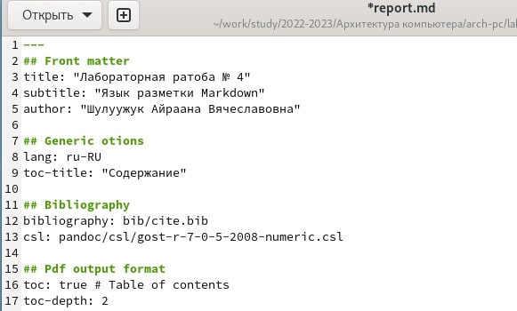

---
## Front matter
title: "Лабораторная ратоба № 4"
subtitle: "Язык разметки Мarkdown"
author: "Шулуужук Айраана Вячеславовна"

## Generic otions
lang: ru-RU
toc-title: "Содержание"

## Bibliography
bibliography: bib/cite.bib
csl: pandoc/csl/gost-r-7-0-5-2008-numeric.csl

## Pdf output format
toc: true # Table of contents
toc-depth: 2
lof: true # List of figures
lot: true # List of tables
fontsize: 12pt
linestretch: 1.5
papersize: a4
documentclass: scrreprt
## I18n polyglossia
polyglossia-lang:
  name: russian
  options:
	- spelling=modern
	- babelshorthands=true
polyglossia-otherlangs:
  name: english
## I18n babel
babel-lang: russian
babel-otherlangs: english
## Fonts
mainfont: PT Serif
romanfont: PT Serif
sansfont: PT Sans
monofont: PT Mono
mainfontoptions: Ligatures=TeX
romanfontoptions: Ligatures=TeX
sansfontoptions: Ligatures=TeX,Scale=MatchLowercase
monofontoptions: Scale=MatchLowercase,Scale=0.9
## Biblatex
biblatex: true
biblio-style: "gost-numeric"
biblatexoptions:
  - parentracker=true
  - backend=biber
  - hyperref=auto
  - language=auto
  - autolang=other*
  - citestyle=gost-numeric
## Pandoc-crossref LaTeX customization
figureTitle: "Рис."
tableTitle: "Таблица"
listingTitle: "Листинг"
lofTitle: "Список иллюстраций"
lotTitle: "Список таблиц"
lolTitle: "Листинги"
## Misc options
indent: true
header-includes:
  - \usepackage{indentfirst}
  - \usepackage{float} # keep figures where there are in the text
  - \floatplacement{figure}{H} # keep figures where there are in the text
---

# Цель работы

Целью работы является освоение процедуры оформления отчетов с помощью
легковесного языка разметки Markdown

# Задание

1. Заполнить отчет № 4 с помощью текстового редактора и скомпилировать с использованием Makefile.
2. Загрузить файлы на Github
3. Выполнить задание для самостоятельной работы

# Выполнение лабораторной работы

1. Открываем файл report.md с помошью текстового редактора и оформить отчет (рис. [-@fig:001])

{ #fig:001 width=70% }

2. Скомпилируем отчет с использованием Makefile. В итоге получаем документы в форматах doc и pdf.
3. Отправляем файлы на Github

# Выполнение самостоятельной работы
## Задание для самостоятельной работы 

1. Выполнить отчет по лабораторной работе № 3 в формате Markdown
1. Загрузить файлы на Github

# Выводы

Были освоены процедуры оформления отчетов с помощью языка разметки Markdown. Оформлены и скомпилированы с помощью Makefile отчет 3 и отчет 4. 

::: {#refs}
:::
