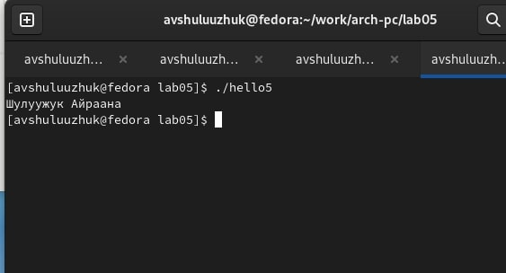

---
## Front matter
title: "Лабораторная работа № 5"
subtitle: "Создание и процесс обработки программ на языке ассемблера NASM"
author: "Шулуужук Айраана В."

## Generic otions
lang: ru-RU
toc-title: "Содержание"

## Bibliography
bibliography: bib/cite.bib
csl: pandoc/csl/gost-r-7-0-5-2008-numeric.csl

## Pdf output format
toc: true # Table of contents
toc-depth: 2
lof: true # List of figures
lot: true # List of tables
fontsize: 12pt
linestretch: 1.5
papersize: a4
documentclass: scrreprt
## I18n polyglossia
polyglossia-lang:
  name: russian
  options:
	- spelling=modern
	- babelshorthands=true
polyglossia-otherlangs:
  name: english
## I18n babel
babel-lang: russian
babel-otherlangs: english
## Fonts
mainfont: PT Serif
romanfont: PT Serif
sansfont: PT Sans
monofont: PT Mono
mainfontoptions: Ligatures=TeX
romanfontoptions: Ligatures=TeX
sansfontoptions: Ligatures=TeX,Scale=MatchLowercase
monofontoptions: Scale=MatchLowercase,Scale=0.9
## Biblatex
biblatex: true
biblio-style: "gost-numeric"
biblatexoptions:
  - parentracker=true
  - backend=biber
  - hyperref=auto
  - language=auto
  - autolang=other*
  - citestyle=gost-numeric
## Pandoc-crossref LaTeX customization
figureTitle: "Рис."
tableTitle: "Таблица"
listingTitle: "Листинг"
lofTitle: "Список иллюстраций"
lotTitle: "Список таблиц"
lolTitle: "Листинги"
## Misc options
indent: true
header-includes:
  - \usepackage{indentfirst}
  - \usepackage{float} # keep figures where there are in the text
  - \floatplacement{figure}{H} # keep figures where there are in the text
---

# Цель работы

Освоение процедуры компиляции и сборки программ, написанных на ассемблере NASM.

# Задание

Здесь приводится описание задания в соответствии с рекомендациями
методического пособия и выданным вариантом.

# Выполнение лабораторной работы

## Программа Hello world!

Создаем каталог для работы с программами на языке ассемблера NASM. 

Переходим в созданный каталог и создаем текстовый файл с именем hello.asm, далее открываем этот файл с помощью текстового редактора. 

Введем текст программы (рис. [-@fig:001])

{ #fig:001 width=70% }

## Транслятор NASM

Скомпилируем текст программы «Hello World». Введем следующую команду:

```
nasm -f elf hello.asm
```

Транслятор преобразует текст программы из файла hello.asm в объектный код, который запишется в файл
hello.o  (рис. [-@fig:002])

{ #fig:002 width=70% }

## Расширенный синтаксис командной строки NASM

Выполним следующую команду:

```
nasm -o obj.o -f elf -g -l list.lst hello.asm
```

Эта команда скомпилирует файл hello.asm в obj.o .Также буден создан файл листина list.lst. Далее проверим созданные файлы (рис. [-@fig:003])

{ #fig:003 width=70% }

## Компоновщик LD

1. Передаем объектный файл на обработку компоновщику: 

```
ld -m elf_i386 hello.o -o hello
```

Будет создан файл hello

2. Выполняя следующую команду:

```
ld -m elf_i386 obj.o -o main
```
из объектного файла obj.o будет создан исполняемый файл main (рис. [-@fig:004])

{ #fig:004 width=70% }

## Запуск исполняемого файла

Набрав команду:

```
./hello
```
Запустим на выполнение созданный исполняемый файл (рис. [-@fig:005])

{ #fig:005 width=70% }

# Выполнение самостоятельной работы

задание для самостоятельной работы: вывести фамилию и имя 

1. Внести изменения в тексте программы с помощью тектового редактора. Вместо Hello world! вставить фамилию и имя.
2. Оттранслировать текст программы в объектный файл. Выполнить компоновку объектного файла и запустить файл
3. Загрузить файлы на Github

## Порядок выполнения самостоятельной работы 

1. Создаем копию файла hello.asm с именем lab5.asm
2. С помощью текстового редактора внесем изменения в текст программы в файле ab5.asm, вносим фамилию и имя (рис. [-@fig:006])

{ #fig:006 width=70% }

3. Оттранслируем полученный текст программы lab5.asm в объектный файл. Далее выполним компоновку объектного файла (рис. [-@fig:007])

{ #fig:007 width=70% }

в итоге получаем файлы hello5 и main5

4. Запускаем получившийся файл с выводом имени и фамилии (рис. [-@fig:008])

{ #fig:008 width=70% }

5. Копируем файлы hello.asm и lab5.asm в локальный репозиторий и загружаем файла на github

# Выводы

Были овоены процедуры компиляции и сборки текстов программ "Hello world!", а также текст программы с выводои имени и фамилии 

::: {#refs}
:::
