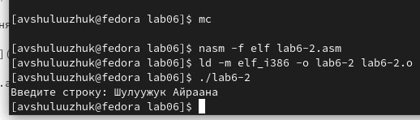

---
## Front matter
title: "Лабораторная работа № 6"
subtitle: "Основы работы с Midnight Commander (mc). Структура программы на языке ассемблера NASM.
Системные вызовы в ОС GNU Linux"
author: "Шулуужук Айраана В."

## Generic otions
lang: ru-RU
toc-title: "Содержание"

## Bibliography
bibliography: bib/cite.bib
csl: pandoc/csl/gost-r-7-0-5-2008-numeric.csl

## Pdf output format
toc: true # Table of contents
toc-depth: 2
lof: true # List of figures
lot: true # List of tables
fontsize: 12pt
linestretch: 1.5
papersize: a4
documentclass: scrreprt
## I18n polyglossia
polyglossia-lang:
  name: russian
  options:
	- spelling=modern
	- babelshorthands=true
polyglossia-otherlangs:
  name: english
## I18n babel
babel-lang: russian
babel-otherlangs: english
## Fonts
mainfont: PT Serif
romanfont: PT Serif
sansfont: PT Sans
monofont: PT Mono
mainfontoptions: Ligatures=TeX
romanfontoptions: Ligatures=TeX
sansfontoptions: Ligatures=TeX,Scale=MatchLowercase
monofontoptions: Scale=MatchLowercase,Scale=0.9
## Biblatex
biblatex: true
biblio-style: "gost-numeric"
biblatexoptions:
  - parentracker=true
  - backend=biber
  - hyperref=auto
  - language=auto
  - autolang=other*
  - citestyle=gost-numeric
## Pandoc-crossref LaTeX customization
figureTitle: "Рис."
tableTitle: "Таблица"
listingTitle: "Листинг"
lofTitle: "Список иллюстраций"
lotTitle: "Список таблиц"
lolTitle: "Листинги"
## Misc options
indent: true
header-includes:
  - \usepackage{indentfirst}
  - \usepackage{float} # keep figures where there are in the text
  - \floatplacement{figure}{H} # keep figures where there are in the text
---

# Цель работы

Приобретение практических навыков работы в Midnight Commander. Освоение инструкций языка ассемблера mov и int

# Выполнение лабораторной работы

1. Откороем Midnight Commander и создаем каталог lab06 для выполнения лабораторной работы № 6. В этом каталоге создаем файл lab6-1.asm (рис. [-@fig:001])

{ #fig:001 width=70% }

2. Откроем этот файл с помощью функциональной клавиши для редактирования во встроеном редакторе mcedit.
Введем текст программы из листинга (рис. [-@fig:002])

{ #fig:002 width=70% }

3. Оттранслируем текст программы lab6-1.asm в объектный файл. Далее выполним компоновку объектного файла и запустим получившийся исполняемый файл. 

Программа выводит строку "Введите строку". На запрос введем ФИО.  (рис. [-@fig:003])

{ #fig:003 width=70% }

## Подключение внешнего файла in_out.asm

1. Скачиваем файл in_out.asm со страницы курса в ТУИС

2. Скопируем файл in_out.asm в каталог с файлом lab6-1.asm с помощью функциональной клавиши F5 
(рис. [-@fig:004])

{ #fig:004 width=70% }

3. Откроем файл lab6-2.asm в редакторе и испрвим текст с использование подпрограмм из внешнего файла in_out.asm в соответствии с листингом (рис. [-@fig:005])

{ #fig:005 width=70% }

4. Создайте исполняемый файл и проверьте его работу (рис. [-@fig:006])

{ #fig:006 width=70% }

5. В файле lab6-2.asm заменим подпрограмму sprintLF на sprint. Создаем исполняемый файл и проверим его работу. В результате перевод на вовую строку не осуществится (рис. [-@fig:007])

{ #fig:007 width=70% }

# Выпонение задания для самостоятельной работы 

1. Создать копию файла lab6-1.asm. Внести изменения в программу (без использования внешнего файла in_out.asm), так чтобы она работала по
следующему алгоритму:

   • вывести приглашение типа “Введите строку:”;
   
   • ввести строку с клавиатуры;
   
   • вывести введённую строку на экран

2. Создать копию файла lab6-2.asm. Исправить текст программы с использование подпрограмм из внешнего файла in_out.asm, так чтобы она работала по следующему алгоритму:

   • вывести приглашение типа “Введите строку:”;
   
   • ввести строку с клавиатуры;
   
   • вывести введённую строку на экран.

# Выводы

Были приобретены практические навыки работы в Midnight Commander. Также освоены нструкций языка ассемблера mov и int.

::: {#refs}
:::
