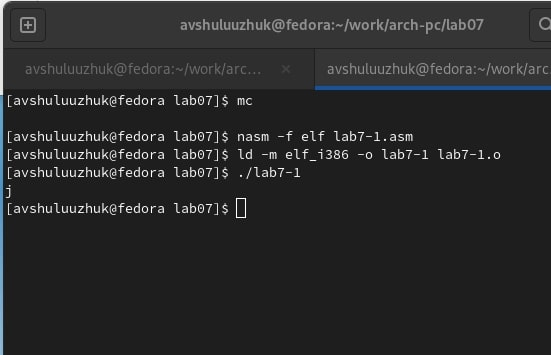
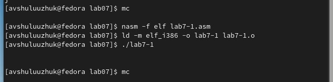
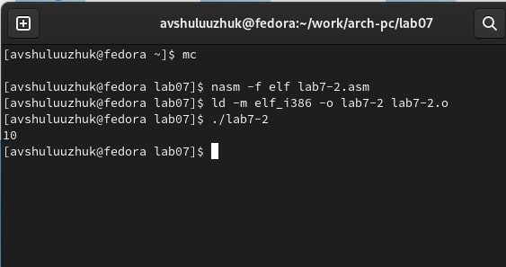
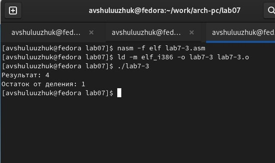
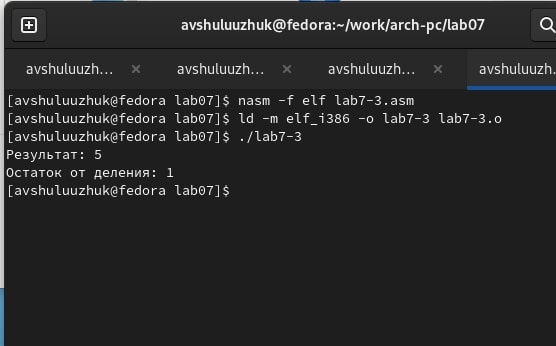
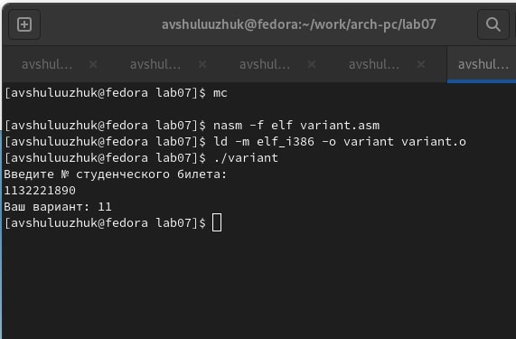
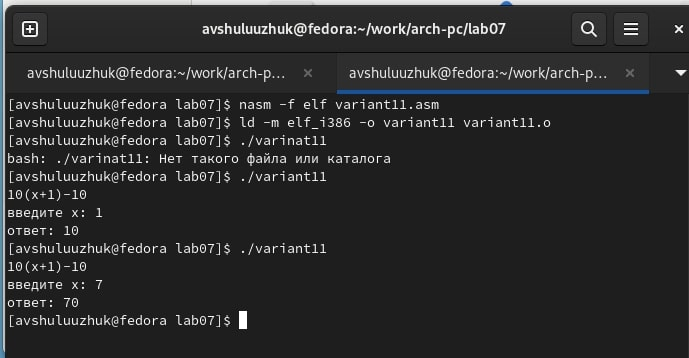

---
## Front matter
title: "Лабораторная работа № 7"
subtitle: "Арифметические операции в NASM"
author: "Шулуужук Айраана Вячеславовна"

## Generic otions
lang: ru-RU
toc-title: "Содержание"

## Bibliography
bibliography: bib/cite.bib
csl: pandoc/csl/gost-r-7-0-5-2008-numeric.csl

## Pdf output format
toc: true # Table of contents
toc-depth: 2
lof: true # List of figures
lot: true # List of tables
fontsize: 12pt
linestretch: 1.5
papersize: a4
documentclass: scrreprt
## I18n polyglossia
polyglossia-lang:
  name: russian
  options:
	- spelling=modern
	- babelshorthands=true
polyglossia-otherlangs:
  name: english
## I18n babel
babel-lang: russian
babel-otherlangs: english
## Fonts
mainfont: PT Serif
romanfont: PT Serif
sansfont: PT Sans
monofont: PT Mono
mainfontoptions: Ligatures=TeX
romanfontoptions: Ligatures=TeX
sansfontoptions: Ligatures=TeX,Scale=MatchLowercase
monofontoptions: Scale=MatchLowercase,Scale=0.9
## Biblatex
biblatex: true
biblio-style: "gost-numeric"
biblatexoptions:
  - parentracker=true
  - backend=biber
  - hyperref=auto
  - language=auto
  - autolang=other*
  - citestyle=gost-numeric
## Pandoc-crossref LaTeX customization
figureTitle: "Рис."
tableTitle: "Таблица"
listingTitle: "Листинг"
lofTitle: "Список иллюстраций"
lotTitle: "Список таблиц"
lolTitle: "Листинги"
## Misc options
indent: true
header-includes:
  - \usepackage{indentfirst}
  - \usepackage{float} # keep figures where there are in the text
  - \floatplacement{figure}{H} # keep figures where there are in the text
---

# Цель работы

Освоение арифметических инструкций языка ассемблера NASM

# Задание

Здесь приводится описание задания в соответствии с рекомендациями
методического пособия и выданным вариантом.

# Выполнение лабораторной работы

## Символьные и численные данные в NASM

1. Создаем каталог для программ лабораторной работы №7.
Далее создаем файл lab7-1.asm и введем текст из листинга 7.1.
Создаем исполняемый файл и запускаем его. В результате будет j (рис. [-@fig:001])

{ #fig:001 width=70% }

2. Изменяем текст программы и вместо символов запишем регистры чисел. В результате на экране ничего не  выводится (рис. [-@fig:002])

{ #fig:002 width=70% }

3. Создаем новый файл lab7-2.asm и введем текст для программы вывода значения регистра eax.
В результате работы программы мы получим 106. 

4. Заменяем текст программы, меняя строки с символами на регистры чисел. В результате работы программы выводится 10 (рис. [-@fig:003])

{ #fig:003 width=70% }

Если функцию iprintLF поменяем на iprint, то в результате мы не получим переход на новую строку 

## Выполнение арифметических операций в NASM

1. Создаем новый файл lab7-3.asm и введем текст программы для вычисления вырaжения 𝑓(𝑥) = (5 ∗ 2 + 3)/3.
Запускаем этот файл (рис. [-@fig:004])

{ #fig:004 width=70% }

2. Изменим текст программы для вычисления выражения 𝑓(𝑥) = (4 ∗ 6 + 2)/5.
Проверим его работу (рис. [-@fig:005])

{ #fig:005 width=70% }

3. Далее рассмотрим следующюю программу для вычисления варианта задания по номеру студенческого билета.
Создаем новый файл variant.asm и введем в этот файл текст программы для вычисления варианта.

Запускаем этот файл, введем номер студенческого билета и получаем вариант задания 11 (рис. [-@fig:006])

{ #fig:006 width=70% }

## Ответы на вопросы

1. Cтроки в листинге 7.4, которые отвечают за вывод на экран сообщения "Ваш вариант" 
``` mov eax,rem
    call sprint
```
2. Следующие инструкции отвечаю за:
 
"mov ecx, x" - запись адреса переменной в 'eax' 

"mov edx, 80" - запись длины вводимого сообщения в 'ebx' 

"call sread" вызов функции для ввода сообщения с клавиатуры  

3. Инстркукция "сall atoi" используется для преобоазования ascii-кода символа в целое число

4. За вычисление варианта в листинге 7.4 отвечают строки:
```
xor edx,edx
mov ebx,20
div ebx
inc edx
```

5. При выполнении инструкции “div ebx” остаток от деления записывается в регистр "AH"

6. Инструкция “inc edx” используется для увеличения значения регистра edx на 1 (единицу)

7. За вывод на зкран результата вычислений из листинка 7.4 отвечают строки:
```
mov  eax,edx
call iprintLF
```

# Выполнение самостоятельной работы 

## Задание для самостоятельной работы

Написать программу вычисления выражения. 

## Самостоятельная работа

1. В результате работы программы для вычисления варианта с помоощью номера студенческого билета выводится вариант 11

2. Для вычиления выражения **f(x) = 10(x + 1) − 10** напишем программу. 

Создаем новый файл variant11.asm
```
touch ~/work/arch-pc/lab07/variant11.asm
```

Введем текст программы в файл variant11.asm (рис. [-@fig:007])

{ #fig:007 width=70% }

3. Создадим исполнемый файл и запустим программу. 

Введем значения х(1) = 1, х(2) = 7   (рис. [-@fig:008])

{ #fig:008 width=70% }

# Выводы

Были освооены арифметические инструкции языка ассемблера NASM.
Результатом лабораторной работы является создание программ для вычисления выражений с помощью арифметических инструкций языка ассемблера NASM

::: {#refs}
:::
