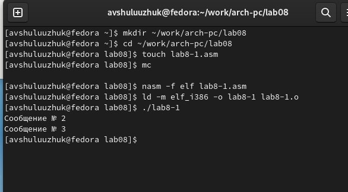
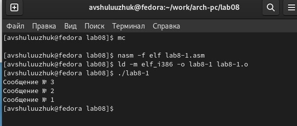
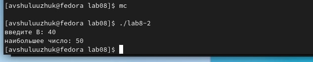
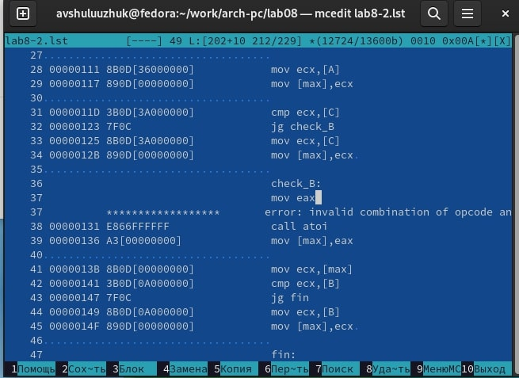
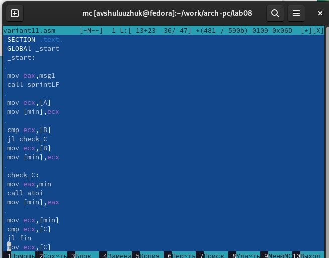
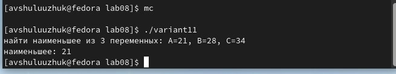
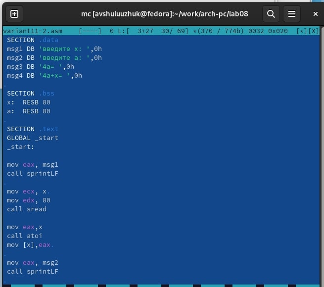
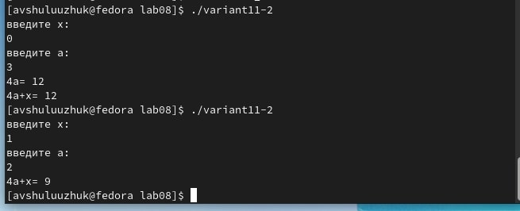

---
## Front matter
title: "Лабораторная работа № 8"
subtitle: " Команды безусловного и условного переходов в Nasm. Программирование ветвлений."
author: "Шулуужук Айраана В."

## Generic otions
lang: ru-RU
toc-title: "Содержание"

## Bibliography
bibliography: bib/cite.bib
csl: pandoc/csl/gost-r-7-0-5-2008-numeric.csl

## Pdf output format
toc: true # Table of contents
toc-depth: 2
lof: true # List of figures
lot: true # List of tables
fontsize: 12pt
linestretch: 1.5
papersize: a4
documentclass: scrreprt
## I18n polyglossia
polyglossia-lang:
  name: russian
  options:
	- spelling=modern
	- babelshorthands=true
polyglossia-otherlangs:
  name: english
## I18n babel
babel-lang: russian
babel-otherlangs: english
## Fonts
mainfont: PT Serif
romanfont: PT Serif
sansfont: PT Sans
monofont: PT Mono
mainfontoptions: Ligatures=TeX
romanfontoptions: Ligatures=TeX
sansfontoptions: Ligatures=TeX,Scale=MatchLowercase
monofontoptions: Scale=MatchLowercase,Scale=0.9
## Biblatex
biblatex: true
biblio-style: "gost-numeric"
biblatexoptions:
  - parentracker=true
  - backend=biber
  - hyperref=auto
  - language=auto
  - autolang=other*
  - citestyle=gost-numeric
## Pandoc-crossref LaTeX customization
figureTitle: "Рис."
tableTitle: "Таблица"
listingTitle: "Листинг"
lofTitle: "Список иллюстраций"
lotTitle: "Список таблиц"
lolTitle: "Листинги"
## Misc options
indent: true
header-includes:
  - \usepackage{indentfirst}
  - \usepackage{float} # keep figures where there are in the text
  - \floatplacement{figure}{H} # keep figures where there are in the text
---

# Цель работы

Изучение команд условного и безусловного переходов. Приобретение навыков написания программ с использованием переходов. Знакомство с назначением и структурой файла листинга.

# Выполнение лабораторной работы

## Реализация переходов в NASM

1. Создадим файл lab8-1.asm и введем текст программы из листинга. Проверим его работу (рис. [-@fig:001])

{ #fig:001 width=70% }

2. Изменим текст программы так, чтобы вывод программы был: (рис. [-@fig:002])

Сообщение No 3

Сообщение No 2

Сообщение No 1

{ #fig:002 width=70% }

3. Создадим новый файл и введем в него из листинга текст программы, которая определяет и выводит на экран наибольшую из 3 целочисленных переменных (рис. [-@fig:003])

{ #fig:003 width=70% }

## Изучение структуры файлы листинга

1. Создадим файл листинга для программы из файла lab8-2.asm. Откроем этот файл с помощью текстового редактора

2. Удалим в любой инструкции с двумя операндами один его операнд. Далее выполним трансляцию с получением файла листинга.

В итоге команда выводит ошибку. А в листинге появляется строка с ошибкой (рис. [-@fig:004])

{ #fig:004 width=70% }

# Задания для самостоятельной работы 

1. Написать программу для нахождения наименьшей из 3 целочисленных переменных A, B, C

2. Написать программу, которая для введенных с клавиатуры значений х и а вычисляет значение заданной функции f(x) и выводит результат вычислений

## Выполнение самостоятельной работы 

1. Создадим файл variant11.asm для первой программы (11 вариант). Введем текст программы 
(рис. [-@fig:005])

{ #fig:005 width=70% }

2. Проверим работу программы (рис. [-@fig:006])

{ #fig:006 width=70% }

3. Создадим новый файл variant11-2 для второй программы, которая для введенных переменных вычисляет значения (11 вариант)  (рис. [-@fig:007])

{ #fig:007 width=70% }

4. Скомпилируем файл и проверим работу для значений х и а (берем значения из 11 варианта)
(рис. [-@fig:008])

{ #fig:008 width=70% }

# Выводы

Были изучены программы для условного и безусловного переходов. Приобретены навыки написания программ с использованием переходов. Ознакомились с назначением и структурой файла листина 

::: {#refs}
:::
