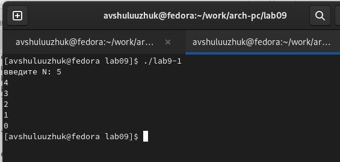
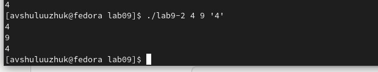
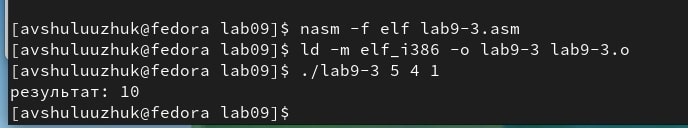
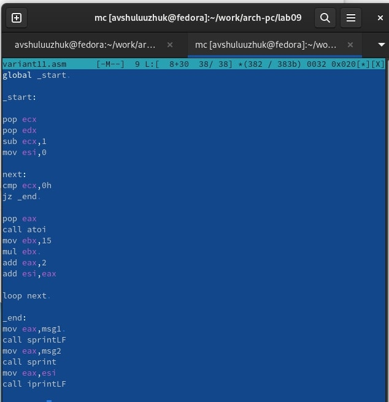
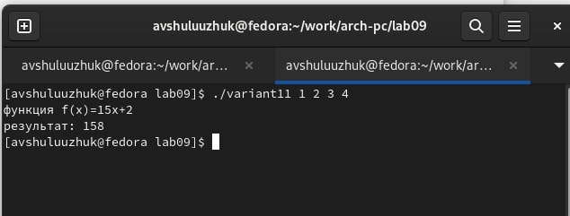

---
## Front matter
title: "Лабораторная работа № 9"
subtitle: "Программирование цикла. Обработка аргументов командной строки"
author: "Шулуужук Айраана В."

## Generic otions
lang: ru-RU
toc-title: "Содержание"

## Bibliography
bibliography: bib/cite.bib
csl: pandoc/csl/gost-r-7-0-5-2008-numeric.csl

## Pdf output format
toc: true # Table of contents
toc-depth: 2
lof: true # List of figures
lot: true # List of tables
fontsize: 12pt
linestretch: 1.5
papersize: a4
documentclass: scrreprt
## I18n polyglossia
polyglossia-lang:
  name: russian
  options:
	- spelling=modern
	- babelshorthands=true
polyglossia-otherlangs:
  name: english
## I18n babel
babel-lang: russian
babel-otherlangs: english
## Fonts
mainfont: PT Serif
romanfont: PT Serif
sansfont: PT Sans
monofont: PT Mono
mainfontoptions: Ligatures=TeX
romanfontoptions: Ligatures=TeX
sansfontoptions: Ligatures=TeX,Scale=MatchLowercase
monofontoptions: Scale=MatchLowercase,Scale=0.9
## Biblatex
biblatex: true
biblio-style: "gost-numeric"
biblatexoptions:
  - parentracker=true
  - backend=biber
  - hyperref=auto
  - language=auto
  - autolang=other*
  - citestyle=gost-numeric
## Pandoc-crossref LaTeX customization
figureTitle: "Рис."
tableTitle: "Таблица"
listingTitle: "Листинг"
lofTitle: "Список иллюстраций"
lotTitle: "Список таблиц"
lolTitle: "Листинги"
## Misc options
indent: true
header-includes:
  - \usepackage{indentfirst}
  - \usepackage{float} # keep figures where there are in the text
  - \floatplacement{figure}{H} # keep figures where there are in the text
---

# Цель работы

Приобретение навыков написания программ с использованием циклов и обработкой аргументов командной строки.

# Выполнение лабораторной работы#

## Реализация циклов в NASM

Создадим файл lab9-1.asm и внесем в него текст программы из листинга 9.1

Скомпонируем данный файл и в результате получим некорректную работу прорграммы.

Далее немного изменяем программу,  добавив команды  push и pop. Скомпонируем этот файл и получаем корректную работу программы (рис. [-@fig:001])

{ #fig:001 width=70% }

## Обработка аргументов командной строки

Создадим следующий файл  lab9-2.asm  для обработки аргументов командной строки.
Введем в этот файл текст программы из листинга 9.2. Скомпонируем данный файл и запустим его, указав аргументы (рис. [-@fig:002]) В результате программой было обработано 3 аргумента

{ #fig:002 width=70% }

## Программа вычисления суммы аргументов командной строки

Создаем новый файл и введем текст программы из листинга 9.3. Эта программа для вычисления суммы аргументов командной строки.

Запустим исполняемый файл и укажем аргументы (рис. [-@fig:003]) 

{ #fig:003 width=70% }

# Выполнение задания для самостоятельной работы

1. Напишем программу, которая находит сумму значений функции для х
2. Создадим файл variant11.asm (в соответствие варианту 11)
3. Набираем текст программы  (рис. [-@fig:004])

{ #fig:004 width=70% }

4. Создадим исполняемый файл и запустим программу, введя аргуметы х (рис. [-@fig:005])

{ #fig:005 width=70% }

# Выводы

Были приобретены навыки написания программ с использованием цикллов и ообработкой аргументов командной строки

::: {#refs}
:::
